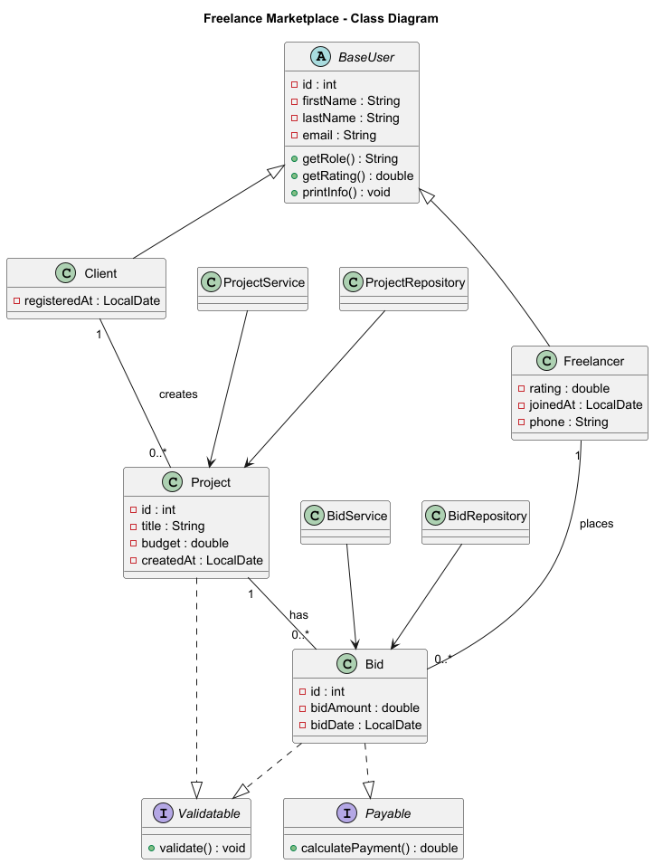
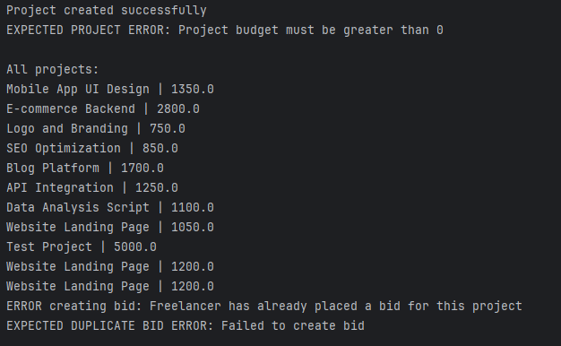

# Freelance Marketplace (JDBC + OOP)

## Project Overview

This project is a **console-based Java application** that simulates a **freelance marketplace**.  
It demonstrates how object-oriented programming principles can be combined with **JDBC** to work with a **real PostgreSQL database** using a clean, layered architecture.

The system allows clients to create projects, freelancers to place bids, and enforces business rules such as preventing duplicate bids for the same project.

---

## Entities and Relationships

### Main Entities

- **Client** – a customer who creates projects
- **Freelancer** – a specialist who bids on projects
- **Project** – a job posted by a client
- **Bid** – an offer made by a freelancer for a project

### Relationships

- A **Client** can have many **Projects**
- A **Project** belongs to one **Client**
- A **Freelancer** can place many **Bids**
- A **Bid** links one **Freelancer** and one **Project**
- A **Freelancer can bid only once per project** (composite UNIQUE constraint)

---

## OOP Design

### Abstract Class

**BaseUser (abstract)**

- Fields: `id`, `firstName`, `lastName`, `email`
- Abstract methods: `getRole()`, `getRating()`
- Concrete method: `printInfo()`

### Inheritance

- `Client extends BaseUser`
- `Freelancer extends BaseUser`

### Interfaces

- **Validatable** – defines `validate()` method for input validation
- **Payable** – defines payment-related behavior

### Composition

- `Project` contains a `Client`
- `Bid` contains a `Project` and a `Freelancer`

### Polymorphism

Objects of `Client` and `Freelancer` are handled via `BaseUser` references.

---

## Database Description (PostgreSQL)

### Tables

- `clients`
- `freelancers`
- `projects`
- `bids`
- `contracts`
- `reviews`

### Key Constraints

- Primary keys on all tables
- Foreign keys between related entities
- UNIQUE constraint on `bids (project_id, freelancer_id)`
- CHECK constraints for rating and budget

---

## JDBC & Architecture

### Layered Architecture

Controller (Main)
↓
Service (business logic + validation)
↓
Repository (SQL, JDBC, PreparedStatement)
↓
PostgreSQL

### JDBC Features

- `DriverManager` for connection handling
- `PreparedStatement` for all SQL operations
- No usage of `Statement`
- Proper exception handling and resource management

---

## Exception Handling

Custom exception hierarchy:

- `InvalidInputException`
- `DuplicateResourceException`
- `ResourceNotFoundException`
- `DatabaseOperationException`

PostgreSQL SQLState **23505** (UNIQUE constraint violation) is converted into a  
`DuplicateResourceException` at the service layer.

---

## UML Diagram

The UML class diagram illustrating entities, inheritance, interfaces, and relationships:

---

## Demonstration (CLI Output)

The `Main` class demonstrates:

- Creating a valid project
- Triggering validation error (negative budget)
- Reading all projects from the database
- Creating a bid
- Triggering duplicate bid error

Console output:

---

## How to Run

1. Start PostgreSQL server
2. Create the database and tables using `resources/schema.sql`
3. Configure database credentials in `DatabaseConnection.java`
4. Run `Main.java`

---

## Reflection

During this project, I learned how to:

- Design a clean multi-layer architecture
- Apply OOP principles in a real-world scenario
- Work with PostgreSQL using JDBC
- Enforce business rules at both database and service levels
- Handle SQL exceptions and convert them into meaningful business errors

The main challenge was synchronizing Java objects with database constraints, especially foreign keys and unique constraints.  
This project helped me understand how backend systems are structured and how responsibilities are separated across layers in real applications.
